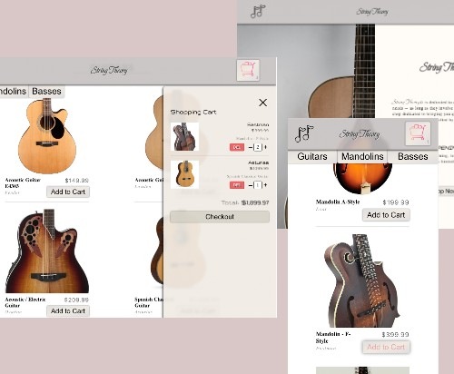

# Shopping Cart (React)

A fake website imitating store fronts with shopping carts. **Click the STRING THEORY title in header to access homepage -- bug-to-be-fixed** *-- see note in [continued development](#continued-development)

## Table of contents

- [Overview](#overview)
  - [The challenge](#the-challenge)
  - [Screenshot](#screenshot)
  - [Links](#links)
- [My process](#my-process)
  - [Built with](#built-with)
  - [What I learned](#what-i-learned)
  - [Continued development](#continued-development)

## Overview

### The challenge

Users should be able to:

- Navigate between landing page and all product pages
- Open and view shopping cart
- Add items to shopping cart
- Increment and decrement items in shopping cart
- Delete items in shopping cart
- Calculate shopping cart total

Programming process should include:

- Using functional React
- Focusing on unidirectional data flow (passing information between states and props)
- Using React Router for page navigation

### Screenshot

### Links

- Live Site URL: [Shopping Cart](https://jessejputnam.github.io/shopping-cart/)

## My process

### Built with

- Flexbox
- Mobile-first workflow
- JavaScript
- React.js
- [Jest](https://jestjs.io/) - Testing framework
- [Webpack](https://webpack.js.org/) - Module Bundler

### What I learned

This project started getting me more familiar with the flow and control of data between components. It really solidified that concept that child components listen for events, then pass that event up to the parent with state before the parent changes the state and sends the new data-set down to the child to be rendered.

### Continued development

- I encountered an issue at the very end, while trying to deploy to github. The React Router switching behaves very differently on my local live server than on the hosted server. I could not find a solution that satisfied both scenarios equally. I need to do more research to discover (a) what the issue actually is that is causing the effect of different behavior and (b) what solutions may already exist for it.
